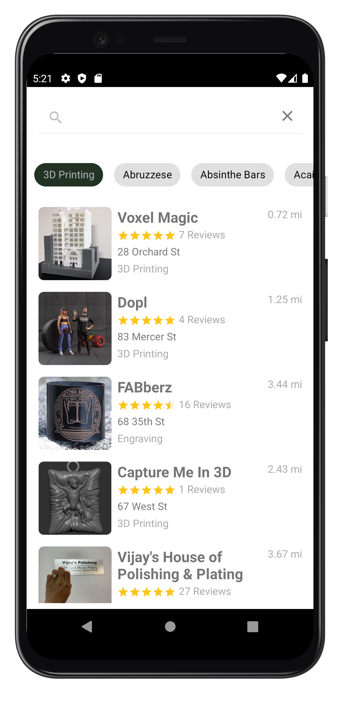
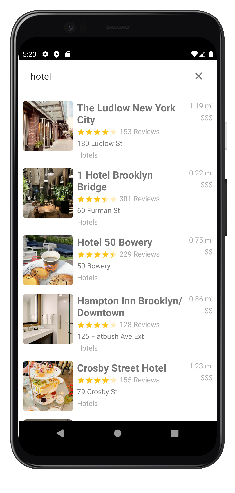
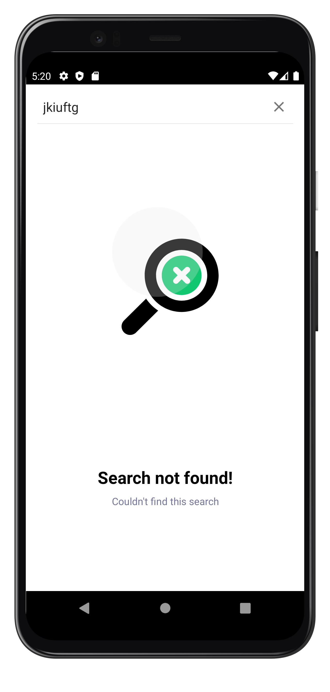

# Yelpo

## 💻 Requirements

- Any Operating System (ie. MacOS X, Linux, Windows)
- Android Studio
- A little knowledge of Kotlin and Android Sdk

## ✨ Features
- [x] Search for businesses by keyword.
- [x] Search businesses by category.
- [x] Add bussiness to favorites (work in progress).
- [x] Display businesses on Google maps

## 📸 ScreenShots

 |   
    | 

## 🔌 Plugins

| Name                                                    | Usage                                               |
| ------------------------------------------------------- | --------------------------------------------------- |
| [**Retrofit**](https://square.github.io/retrofit/)      | HTTP Requests                                       |
| [**Glide**](https://bumptech.github.io/glide/)          | Loading Photos                                      |
| [**Shimmer**](https://facebook.github.io/shimmer-android/)| Loading animation                                 |
| [**Room Library**](https://developer.android.com/jetpack/androidx/releases/room)| Loading animation           |

## 🤓 Author(s)

**Azefack Nopunkwe George**
